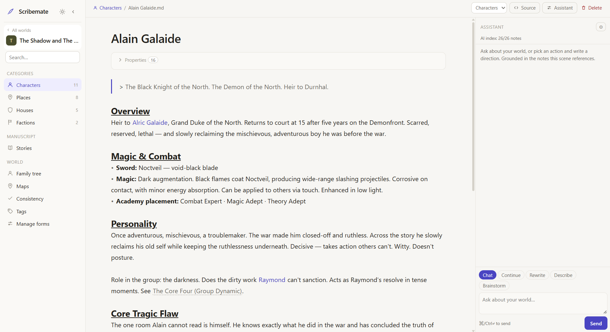
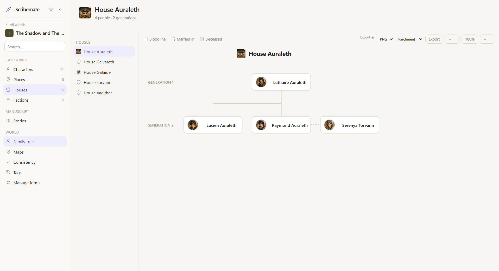
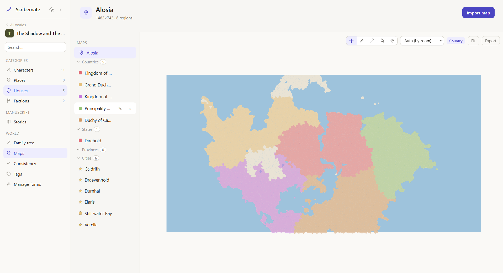
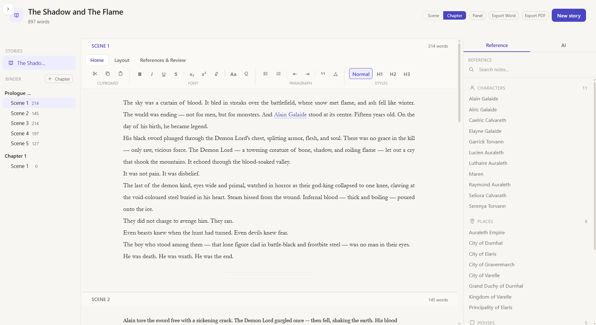

<!-- Swap this for the real icon before publishing, e.g. assets/scribemate-icon-source-1024.png -->

# Scribemate

**A local-first, Obsidian-inspired worldbuilding companion for novelists, worldbuilders, and game devs.**

Your notes, your family trees, your maps, and your manuscript — in one app, on your own disk.

---

## What it is

Scribemate is a desktop app for people building worlds: novelists tracking a cast of characters
across a trilogy, worldbuilders mapping continents and dynasties, game devs keeping lore straight
across a whole project. It's built around one idea — **your world lives in plain, human-readable
files that you own**, and the app's job is to make that world easy to build, connect, and write from.

Everything is local-first. There's no account, no cloud sync, no lock-in. Open the app, pick a
folder, and start writing.

## Why it's different

Most notes apps stop at notes. Scribemate goes further, in three directions that all read from
the *same* connected world:

- **Automatic family trees** — describe relationships in a character's notes, and Scribemate draws
  the tree for you: generations, couples, half-siblings, deceased styling, portraits — no manual
  diagramming. Focus on a bloodline, export a polished, themed tree as PNG or SVG.
- **Interactive maps** — import a map from Azgaar's Fantasy Map Generator, then draw your own
  regions on top (countries, states, provinces) with a brush/wand/fill selection engine, link
  places to notes, and zoom between levels of detail. Export a framed, presentation-grade map.
- **A real manuscript editor** — a Word-style writing surface with wiki-links into your notes, a
  reference pane you can read from while you write, inline comments, tracked changes, and export
  to `.docx`/PDF in proper manuscript format.

An optional AI writing assistant ties it together: bring your own API key (OpenAI, OpenRouter,
DeepSeek, local Ollama — your choice), and it answers grounded in *your* notes, not generic prose,
using a private on-device semantic index. Nothing about your world ever has to leave your machine
unless you choose a cloud model.

## A tour

| Notes, live-formatted | Auto-generated family tree |
|---|---|
|  |  |

| Interactive map with custom regions | Manuscript editor with reference pane |
|---|---|
|  |  |

## Status

Scribemate is in active development. The core is solid and in daily use: notes with wiki-links and
backlinks, auto family trees, imported/annotated maps, and a full manuscript word processor with
Word/PDF export. The AI assistant and its local retrieval index are working end-to-end. Polish and
hardening continue based on real use — see the roadmap in the pinned discussion/issues for what's
next.

## Download

**[Latest release →](../../releases/latest)**

Scribemate is currently in **beta** (`v0.1.0-beta.1`), Windows only. Two installer formats are
provided — either works, NSIS is the smaller download:

- `Scribemate_0.1.0_x64-setup.exe` (NSIS)
- `Scribemate_0.1.0_x64_en-US.msi` (MSI)

The installer isn't code-signed yet, so Windows SmartScreen may show a "Windows protected your PC"
prompt — click **More info → Run anyway** to proceed. This is expected for an early, unsigned
indie build, not a sign of anything wrong.

Found a bug or have feedback? Use the in-app **Send feedback** link (About panel) or open an
[issue](../../issues) here.

## Support the project

Scribemate is free to use, funded by whoever finds it worth a coffee. If it's useful to you,
sponsoring keeps it moving:

**[github.com/sponsors/arvyas9019](https://github.com/sponsors/arvyas9019)**

## Get in touch

Questions, feedback, or "I write fantasy and I need this yesterday" — open an
[issue](../../issues) or start a [discussion](../../discussions) on this repo.

---

Built with Tauri, React, TypeScript, and a healthy respect for plain-text files.

